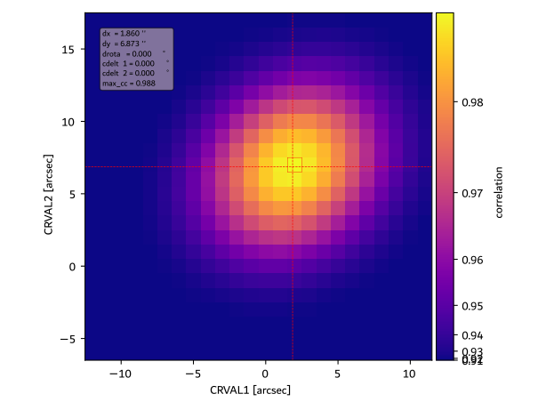

# **euispice_coreg**


Welcome to the euispice_coreg python package :artificial_satellite:. This package can be used to correct the pointing information of SPICE or HRIEUV datasets, on board Solar Orbiter. 

## Description :

This package provides tools to co-align an image from an imager with another one (called "reference" image).  It corrects the pointing information on the FITS header using a cross-correlation algorithm. The data you want to align can be either from an imager (i.e. Solar Orbiter/HRIEUV etc.) or a Solar Orbiter/SPICE raster. Examples on how to align different types of data are provided below.  
In addition, the package provides tools to create a synthethic raster from a set of images (FSI 174 for instance), given the timing of the exposures of a SPICE raster taken as a reference. In this way the SPICE raster can be co-aligned with the synthetic raster. 

As the reference imager, it is advised to use one with a full Sun field of view, with Limb fitting previously applied. Examples of them are the L2 images from the FSI 174 and 304 imagers on board Solar Orbiter. 
The co-alignment itself is performed using a cross-correlation technique, through the Pearson's coefficient, or the residus method. The alignment can be done in the following frames: 

- **Helioprojective**. In this case both images will be reprojected into the coordinate frame of the image to align.  
- **Carrington**: Slower, you have to provide the information to build a pixel grid in a carrington frame. Required if there is a significant time delay between both instruments, or if they do not share the same spacecraft (HRIEUV and AIA for instance).
- **Pixels**. The algorithm slicing over the image pixels, complitely neglecting the headers information. (experimental)

**Warning** As of now, the code works for day to day cases, but has not been thouroughly tested. Please always verify the results with the plot_co_alignment method.
Report any bug you encounter with Github or by e-mailing the author (see adress at the end of the readme). We welcome any suggestion for improvement or remarks.

## Installation
This package is designed to be used in your personal python projects, and to be imported as a standard package.
In your project, a virtual environement can be created with the following command in the shell :
```shell
python -m venv env
source env/bin/activate # write "deactivate" in shell to go out of your virtual environement. 
```
The package is also available on Pypi. You can install it through te following command, while you are in virtual environment, to install the package into your own project: 
```shell
pip install euispice-coreg
```
Alternativelym, if you want the lastest version, you can use the pip install + git command, .

```shell
pip install git+https://github.com/adolliou/euispice_coreg
```

You can also clone the euispice_coreg repository locally. Then, while you are in the virtual environment of your personal project, you can add the Alignment package with the following command :

```shell
cd path/to/euispice_coreg
pip install .
```


## Usage
We provide multiple examples on how to use the code, using different data types, and on different frames. 

### Alignment of an HRIEUV image with FSI 174 in helioprojective coordinates
Here, we co-register an HRIEUV image with an FSI 174 image. We start using Helioprojective coordinates, which is advised if both images are close in time.

```python
import numpy as np
from euispice_coreg.hdrshift import Alignment
import os

path_hri = "path/to/HRIEUV.fits" # path to the HRI FITS file. It must end with a ".fits"
path_fsi = "path/to/FSI174.fits" # path to the FSI FITS file. It must end with a ".fits"
path_save_fits = "path/where/to/save/aligned_fits/fits.fits"  # path to FITS file that .


folder_save_fig = "folder/where/to/save/figure" # path to the folder where to save the figure illustrating the alignment.


param_alignment = {
    "lag_crval1": np.arange(-30, 30, 1), # lag crvals in the headers, in arcsec
    "lag_crval2": np.arange(-30, 30, 1),  # in arcsec
    "lag_crota": np.array([0]), # in degrees
    "lag_cdelt1": np.array([0]), # in arcsec
    "lag_cdelt2": np.array([0]), # in arcsec
}


windows = [-1]

A = Alignment(large_fov_known_pointing=path_fsi, small_fov_to_correct=path_hri, 
              parallelism=True, display_progress_bar=True, counts_cpu_max=20,
              **param_alignment,
              )

results = A.align_using_helioprojective(method='correlation')

results.write_corrected_fits(windows, path_to_l3_output=path_save_fits)
results.plot_correlation(path_save_figure=os.path.join(folder_save_fig, "correlation_results.pdf"))
results.plot_co_alignment(path_save_figure=os.path.join(folder_save_fig, "co_alignment_results.pdf"))

```

**Important Advice** : You should always check the "correlation_results.pdf" figure, to ensure that the shift between the two images are within your lag parameter range. If you notice that the position of the maximum correlation are on the boundaries image, then you should adapt the lag_crval1 and lag_crval2 parameters accordingly. An example of a the type of "correlation_results.pdf" you should obtain is the following (with the maximum correlation not on the boundaries, but well within the figure):  



### Alignment of HRIEUV with FSI 174 using Carrington coordinates

You can also co-register HRIEUV fits files with FSI 174 images within a common Carrington grid, which is advised when both images are taken with significant delay, or if both instruments are on board different spacecrafts. In that case, you have to provide the grid where the aligment is performed. 

```python
import os.path
from euispice_coreg.hdrshift import Alignment
import numpy as np


path_fsi = "path/to/FSI174.fits"
path_hri = "path/to/HRIEUV.fits"


folder_save_fig = "folder/where/to/save/figure"
path_save_fits = "path/where/to/save/aligned_fits"

parallelism = True
param_alignment = {
    "lag_crval1": np.arange(-60, 60, 1), # lag crvals in the headers, in arcsec
    "lag_crval2": np.arange(-60, 60, 1),  # in arcsec
    "lag_crota": np.array([0]), # in degrees
    "lag_cdelt1": np.array([0]), # in arcsec
    "lag_cdelt2": np.array([0]), # in arcsec
}

# Here, we build a common Carrington grid where the alignment will be performed.
lonlims = (200, 300)
latlims = (-20, 20)  # longitude min and max (degrees)
shape = [2048, 2048]


windows = [-1]

A = Alignment(large_fov_known_pointing=path_fsi, small_fov_to_correct=path_hri,
          parallelism=True, display_progress_bar=True,
          small_fov_window=-1, large_fov_window=-1, **param_alignment)

results = A.align_using_carrington(method='correlation', lonlims=lonlims, latlims=latlims, shape=shape)


results.write_corrected_fits(windows, path_to_l3_output=path_save_fits)
results.plot_correlation(path_save_figure=os.path.join(folder_save_fig, "correlation_results.pdf"))
results.plot_co_alignment(path_save_figure=os.path.join(folder_save_fig, "co_alignment_results.pdf"))

```

### Alignment of a SPICE raster  

We show here a typical example to align SPICE data with a synthetic raster created from FSI 304 files. 

####  Creation of a SPICE synthetic raster 
First of all, we need to create a synthetic raster for the SPICE raster using a list of FSI 304 FITS files.
```python
from euispice_coreg.synras import SPICEComposedMapBuilder
from glob import glob
import astropy.units as u


path_spice = "path/to/spice/l2.fits"
path_to_imager_list = glob("path/to/fsi304/*l2.fits")
window_spice = "Ly-gamma-CIII group (Merged)" # The window of the HDULIST for the SPICE FITS file. 
window_imager = -1 # The widow of the HDULIST of the imagers FITS files
threshold_time = u.Quantity(30, "s") # maximum threshold between the SPICE acquisition time, and the closest FSI 304 image. If the code can't any FSI below the threshold, it returns an error 
output_L3_fits = "path/to/output/synthetic_raster_folder"

C = SPICEComposedMapBuilder(path_to_spectro=path_spice, list_imager_paths=path_to_imager_list,
                               window_imager=window_imager, window_spectro=window_spice,
                               threshold_time=threshold_time)
path_to_synras = C.process(folder_path_output=output_L3_fits, return_synras_name=True)
```
#### Alignment of the SPICE raster with the synthetic raster

The code first creates a SPICE pseudo raster by spectrally summing over the chosen HDUList window (here, the C III window). It then cross-correlates the SPICE image with the synthetic raster, while shifting the header values of the SPICE image.
It returns a cross-correlation matrix that can be used to determine the optimal shift to apply to the header values.
The header values that can be shifted are CRVAL1, CRVAL2, CROTA, CDELT1  and CDELT2.

```python
import numpy as np
from euispice_coreg.hdrshift import AlignmentSpice


path_to_synthetic_raster_fits = "path/to/input/synthetic_raster.fits"
path_spice_input = "path/to/spice/l2.fits"
window_spice_to_align =  "Ly-gamma-CIII group (Merged)" # the window used for the co-alignment, here the one which includes the C III line.
windows_spice = ["Mg IX 706 - Peak", # The windows where the pointing will be corrected. It is adviced to correct the shift in all of the spectral windows. 
            "Ne VIII 770 - Peak",
            "S V 786 / O IV 787 - Peak",
            "Ly-gamma-CIII group (Merged)",
            "LyB- FeX group (Merged)",
            "O VI 1032 - Peak"] 
window_sr = -1 # the HDULIST index for the synthetic raster. 
path_save_figure= "path/to/output/figures/folder"

param_alignment = {
    "lag_crval1": np.arange(-50, 50, 1), # lag crvals in the headers, in arcsec
    "lag_crval2": np.arange(-50, 50, 1),  # in arcsec
    "lag_crota": np.array([0]), # in degrees
    "lag_cdelt1": np.array([0]), # in arcsec
    "lag_cdelt2": np.array([0]), # in arcsec
}

parallelism = True

A = AlignmentSpice(large_fov_known_pointing=path_to_synthetic_raster_fits, small_fov_to_correct=path_spice_input,
                         display_progress_bar=True,
                   parallelism=parallelism, counts_cpu_max=10,
                        large_fov_window=window_sr, small_fov_window=window_spice_to_align,
                        path_save_figure=path_save_figure,
                   **param_alignment)

results = A.align_using_helioprojective(method='correlation')
results.write_corrected_fits(windows_spice, path_to_l3_output=path_save_fits)
results.plot_correlation(path_save_figure=os.path.join(folder_save_fig, "correlation_results.pdf"), show=True)
results.plot_co_alignment(path_save_figure=os.path.join(folder_save_fig, "co_alignment_results.pdf"), levels_percentile=[80, 90])

```
Example of a results for co-alignment between a SPICE C III image and a FSI 304 synthetic raster, obtained with plot_co_alignment :


## Correction of instrumental Jitter. 

The code also includes a script to correct the instrumental Jitter, by adapting the method described in Chitta et al, A&A (2022). 
The script separates a list of input FITS files into overlapping sublists, ordered by dates. Then each image is co-aligned in a carrington frame 
with the first image of its sublist. The corrected FITS files are saved in an output folder.

 ```python
from euispice_coreg.jitter_correction import jitter_correction_imagers
from glob import glob
import os


list_files_input = glob.glob(os.path.join("path_to_input_files_folders", "*.fits"))
path_files_output = "path_to_output_folder"
# Carrington grid where the alignment is performed
lonlims = (200, 300)
latlims = (-20, 20)  # longitude min and max (degrees)
shape = [2048, 2048] # number of pixels

sublist_length = 10 # number of images for each sublist
overap = 1 # number of images overlapping between sublists

param_alignment = {
    "lag_crval1": np.arange(-5, 5, 0.5), # lag crvals in the headers, in arcsec
    "lag_crval2": np.arange(-5, 5, 0.5),  # in arcsec
    "lag_crota": np.array([0]), # in degrees
    "lag_cdelt1": np.array([0]), # in arcsec
    "lag_cdelt2": np.array([0]), # in arcsec
}

jitter_correction_images( 
    list_files_input=list_files_input, path_files_output=path_files_output, 
    lonlims=lonlims, latlims=latlims, shape=shape, 
    sublist_length=sublist_length, overlap=overlap, 
    **param_alignment
)

S

 ```


## Acknowledgments

- Carrington transform: [F. Auchère](https://github.com/frederic-auchere)
- SPICE utils: [G. Pelouze](https://github.com/gpelouze)
- Matrix transform: [F. Auchère](https://github.com/frederic-auchere)


## Contact


Author: Antoine Dolliou (dolliou@mps.mpg.de)

## Acknowledgment

If you use this code in your publication, please cite Dolliou et al. (A&A, 2024). DOI: https://doi.org/10.1051/0004-6361/202450439