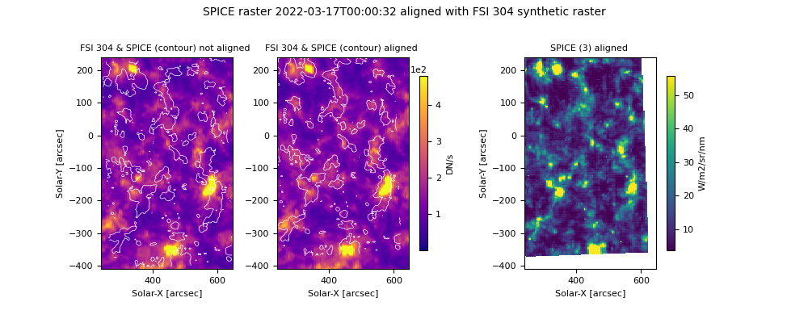

# SPICE_Alignment


Welcome to the SPICE_alignment python package :artificial_satellite: :sun_with_face:. This package can be used to correct the pointing information of SPICE or HRI-EUV datasets, on board Solar Orbiter. 

## Description :

This package provide tools to co-align an image from an imager with another one (called "reference" image).  It corrects the pointing information on the FITS header using a cross-correlation algorithm. The data you want to align can be either from an image (i.e. Solar Orbiter/HRI-EUV etc.) or a Solar Orbiter/SPICE raster. Examples on how to align different types of data are provided below.  
In addition, the package provides tools to create a synthethic raster corresponding to a given SPICE raster, using the dataset of an imager. The obtained synthetic raster can then be used as the reference image to co-align the SPICE raster.

It is advised to use an imager with a Full Sun field of view as the reference image, with Limb fitting previously applied. Example of them include 
the L2 FITS files of the FSI 174 and 304 imagers on board Solar Orbiter. 
The co-alignment itself is performed using a cross-correlation tehcnique, through the Pearson's coefficient, or the residus method. The alignement can be done in the following frames: 

- Helioprojective.
- Carrington. In that case, you have to provide the information to build a pixel grid in a carrington frame.
- by slicing over the image pixels, complitely neglecting the headers information. (experimental)

**Warning** As of now, the code works for day to day cases, but has not been thouroughly tested. Please always verify the results with the plot_co_alignment method.
Report any bug you encounter with Github or by e-mailing the author (see adress at the end of the readme). 

## Installation
This package is designed to be used in your personal python projects, and to be imported as a standard package.
In your project, a virtual environement can be created with the following command in the shell :
```shell
python -m venv env
source env/bin/activate # write "deactivate" in shell to go out of your virtual environement. 
```

You can use the pip install + git command, while you are in virtual environment, to install the package into your own project.

```shell
pip install git+https://github.com/adolliou/SPICE_Alignement
```
You can also clone the SPICE_alignment repository locally. Then, while you are in the virtual environment of your personal project, you can add the Alignment package with the following command :

```shell
cd path/to/SPICE_alignment
pip install .
```


## Usage
We provide multiple examples on how to use the code, using different data types, and on different frames. 

### Alignment of an HRIEUV image with FSI 174 in helioprojective coordinates
Here, we co-register an HRIEUV image with an FSI 174 image. We start using Helioprojective coordinates, which is advised if both images are close in time.

```python
import numpy as np
from SPICE_alignment.hdrshift.alignement import Alignment
from SPICE_alignment.plot.plot import PlotFunctions
from SPICE_alignment.utils.Util import AlignCommonUtil
import os

path_hri = "path/to/HRIEUV.fits"
path_fsi = "path/to/FSI174.fits"

path_save_fig = "path/where/to/save/figure"
path_save_fits = "path/where/to/save/aligned_fits"


lag_crval1 = np.arange(15, 26, 1)
lag_crval2 = np.arange(5, 11, 1)

lag_cdelta1 = [0]
lag_cdelta2 = [0]

lag_crota = [0]
min_value = 0
max_value = 1310

A = Alignment(large_fov_known_pointing=path_fsi, small_fov_to_correct=path_hri, lag_crval1=lag_crval1,
              lag_crval2=lag_crval2, lag_cdelta1=lag_cdelta1, lag_cdelta2=lag_cdelta2, lag_crota=lag_crota,
              parallelism=True, use_tqdm=True, counts_cpu_max=20,
              small_fov_value_min=min_value, small_fov_value_max=max_value, )

corr = A.align_using_helioprojective(method='correlation')
max_index = np.unravel_index(corr.argmax(), corr.shape)


parameter_alignment = {
"lag_crval1": lag_crval1,
"lag_crval2": lag_crval2,
"lag_crota": lag_crota,
"lag_cdelta1": lag_cdelta1,
"lag_cdelta2": lag_cdelta2,

}

PlotFunctions.plot_correlation(corr, lag_crval1=lag_crval1, lag_crval2=lag_crval2, show=True,
                           path_save=os.path.join(path_save_fig, "correlation.pdf"))
PlotFunctions.plot_co_alignment(small_fov_window=-1, large_fov_window=-1, corr=corr,
                            small_fov_path=path_hri, large_fov_path=path_fsi, show=True,
                            results_folder=path_save_fig, levels_percentile=[95],
                            **parameter_alignment)
AlignCommonUtil.write_corrected_fits(path_l2_input=path_hri, window_list=[-1],
                                 path_l2_output=path_save_fits, corr=corr,
                                 **parameter_alignment)

```

### Alignment of HRIEUV with FSI 174 using Carrington coordinates

You can also co-register HRIEUV fits files with FSI 174 images within a common Carrington grid, which is adviced when both images are taken with significant delay. 
In that case, you have to provide the grid where the aligment is performed. 

```python
import os.path
from SPICE_alignment.hdrshift.alignement import Alignment
import numpy as np
from SPICE_alignment.plot.plot import PlotFunctions
from SPICE_alignment.utils.Util import AlignCommonUtil


path_fsi = "path/to/FSI174.fits"
path_hri = "path/to/HRIEUV.fits"


path_save_fig = "path/where/to/save/figure"
path_save_fits = "path/where/to/save/aligned_fits"

parallelism = True

lag_crval1 = np.arange(55, 62, 1)
lag_crval2 = np.arange(-28, -22, 1)
lag_crota = [-39.25]

# Here, we build a common Carrington grid where the alignment will be performed.
lonlims = (200, 300)
latlims = (-20, 20)  # longitude min and max (degrees)
shape = [2048, 2048]


lag_cdelta1 = [0]
lag_cdelta2 = [0]


A = Alignment(large_fov_known_pointing=path_fsi, small_fov_to_correct=path_hri, lag_crval1=lag_crval1,
          lag_crval2=lag_crval2, lag_cdelta1=lag_cdelta1, lag_cdelta2=lag_cdelta2, lag_crota=lag_crota,
          parallelism=True, use_tqdm=True,
          small_fov_window=-1, large_fov_window=-1)

corr = A.align_using_carrington(method='correlation', lonlims=lonlims, latlims=latlims, shape=shape)

parameter_alignment = {
"lag_crval1": lag_crval1,
"lag_crval2": lag_crval2,
"lag_crota": lag_crota,
"lag_cdelta1": lag_cdelta1,
"lag_cdelta2": lag_cdelta2,

}

PlotFunctions.plot_correlation(corr, lag_crval1=lag_crval1, lag_crval2=lag_crval2, lag_drot=lag_crota, show=True,
                           path_save=os.path.join(path_save_fig, "correlation.pdf"))
PlotFunctions.plot_co_alignment(small_fov_window=-1, large_fov_window=-1, corr=corr,
                            small_fov_path=path_hri, large_fov_path=path_fsi, show=True,
                            results_folder=path_save_fig, levels_percentile=[95],
                            **parameter_alignment)
AlignCommonUtil.write_corrected_fits(path_l2_input=path_hri, window_list=[-1],
                                 path_l2_output=path_save_fits, corr=corr,
                                 **parameter_alignment)
```

### Alignment of a SPICE raster  

We show here a typical example to align SPICE data with a synthetic raster created from FSI 304 files. 

####  Creation of a SPICE synthetic raster 
First of all, we need to create a synthetic raster for the SPICE raster using a list of FSI 304 FITS files.
```python
from SPICE_alignment.synras.map_builder import SPICEComposedMapBuilder
from glob import glob
import astropy.units as u


path_spice = "path/to/spice/l2.fits"
path_to_imager_list = glob("path/to/fsi304/*l2.fits")
window_spice = "Ly-gamma-CIII group (Merged)" # The window of the HDULIST for the SPICE FITS file. 
window_imager = -1 # The widow of the HDULIST of the imagers FITS files
threshold_time = u.Quantity(30, "s") # maximum threshold between the SPICE acquisition time, and the closest FSI 304 image. If the code can't any FSI below the threshold, it returns an error 
output_L3_fits = "path/to/output/synthetic_raster_folder"

C = SPICEComposedMapBuilder(path_to_spectro=path_spice, list_imager_paths=path_to_imager_list,
                               window_imager=window_imager, window_spectro=window_spice,
                               threshold_time=threshold_time)
C.process(path_output=output_L3_fits)
```
#### Alignement of the SPICE raster with the synthetic raster

The code first creates a SPICE pseudo raster by spectrally summing over the chosen HDUList window (here, the C III window). It then cross-correlates the SPICE image with the synthetic raster, while shifting the header values of the SPICE image.
It returns a cross-correlation matrix that can be used to determine the optimal shift to apply to the header values.
The header values that can be shifted are CRVAL1, CRVAL2, CROTA, CDELT1  and CDELT2.

```python
import numpy as np
from SPICE_alignment.hdrshift.alignement_spice import AlignmentSpice
from SPICE_alignment.plot.plot import PlotFunctions
from SPICE_alignment.utils.Util import AlignSpiceUtil


path_to_synthetic_raster_fits = "path/to/input/synthetic_raster.fits"
path_spice_input = "path/to/spice/l2.fits"
window_spice_to_align =  "Ly-gamma-CIII group (Merged)" # the window used for the co-alignment, here the one which includes the C III line.
windows_spice = ["Mg IX 706 - Peak", # The windows where the pointing will be corrected. It is adviced to correct the shift in all of the spectral windows. 
            "Ne VIII 770 - Peak",
            "S V 786 / O IV 787 - Peak",
            "Ly-gamma-CIII group (Merged)",
            "LyB- FeX group (Merged)",
            "O VI 1032 - Peak"] 
window_sr = -1 # the HDULIST index for the synthetic raster. 
path_save_figure= "path/to/output/figures/folder"

param_alignement = {
    "lag_crval1": np.arange(-30, -15, 4), # lag crvals in the headers, in arcsec
    "lag_crval2": np.arange(30, 51, 4),  # in arcsec
    "lag_crota": np.array([0]), # in degrees
    "lag_cdelt1": np.array([0]), # in arcsec
    "lag_cdelt2": np.array([0]), # in arcsec
}

parallelism = True

A = AlignmentSpice(large_fov_known_pointing=path_to_synthetic_raster_fits, small_fov_to_correct=path_spice_input,
                         use_tqdm=True,
                   parallelism=parallelism, counts_cpu_max=10,
                        large_fov_window=-1, small_fov_window=window_sr,
                        path_save_figure=path_save_figure,
                   **param_alignement)

corr = A.align_using_helioprojective(method='correlation')
PlotFunctions.plot_correlation(corr, **param_alignement)
AlignSpiceUtil.write_corrected_fits(path_spice_l2_input=path_spice_input, 
                               path_spice_l2_output="path/where/to/save/corrected/fits", corr=corr,
                                    window_spice_list=windows_spice, 
                                    **param_alignement)

PlotFunctions.plot_co_alignment(large_fov_window=-1, large_fov_path=path_to_synthetic_raster_fits,
                                           corr=corr, small_fov_window= window_spice_to_align, 
                                levels_percentile=[80, 90], 
                                           results_folder=None, small_fov_path=path_spice_input, show=True,
                                           **param_alignement)


```
Example of a results for co-alignment between a SPICE C III image and a FSI 304 synthetic raster, obtained with plot_co_alignment :



## Credits

- Carrington transform: [F. Auchère](https://github.com/frederic-auchere)
- SPICE utils: [G. Pelouze](https://github.com/gpelouze)
- Matrix transform: [F. Auchère](https://github.com/frederic-auchere)

## Contact

Author: Antoine Dolliou (antoine.dolliou@universite-paris-saclay.fr)

## Acknowledgment

If you use this code in your publication, please cite Dolliou et al, 2024 (in prep). 